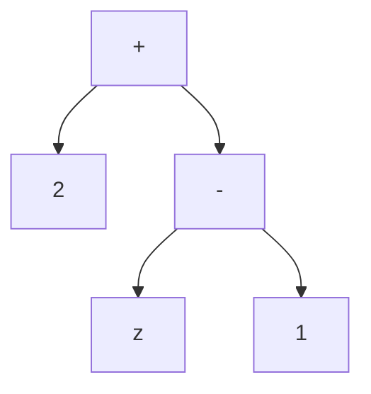
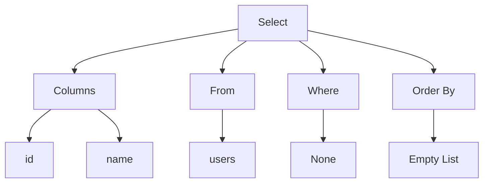

# Week 2 + 3
This week and next, our focus will be on understanding how a **SQL parser** works and how it generates an **Abstract Syntax Tree (AST)**.

## SQL Parser
In the previous Lexer phase, we transformed the raw query string into a sequence of tokens. However, having recognized tokens doesn't necessarily ensure that the sequence is a valid and meaningful query. For example: `data.csv SELECT VALUES *` is not a valid query.

The Parser phase ensures that the sequence of tokens adheres to the grammar rules of our CSV Query Language, constructing a syntactic representation of the query's structure, known as the **Abstract Syntax Tree (AST)**.

## Abstract Syntax Tree(AST)
In general, the AST models the relationships between tokens in the source code as a tree structure, where each node represents a specific component of the code. Each node contains information about the type of token and any associated data.

Let's draw the AST corresponding to the following equation:
```cpp
2 + (z - 1)
```


In the above AST representation, the nodes `+` and `-` are operators, `z` is a variable, and `1` and `2` are just literals. Notice how the parentheses are discarded in the AST; they're subsumed in the representation of `(z - 1)`: `z` and `1` are both children of the `-` operator node.

## Goal
Example SQL query:
```sql
SELECT id, name FROM users;
```
- **Parser input**: Stream of tokens
  ```cpp
  {
    Token::Keyword(Keyword::Select),
    Token::Identifier("id"),
    Token::Comma,
    Token::Identifier("name"),
    Token::Keyword(Keyword::From),
    Token::Identifier("users"),
    Token::SemiColon,
    Token::Eof
  }
  ```
- **Parser output**: AST

## Implementation
### 1. Define AST data structure
> Check [here](./ast.cpp)
- **SQL Statements**: Identify and define the different types of SQL statements that the parser will support. These statement types are derived from the base class `Statement`, include `Create`, `Select`, `Delete`, `Update`, `Insert`, `Drop`.
- **Expressions**: Define the possible expressions that can be used in SQL statements. These expression types are derived from the base class `Expression`, include `Identifier`, `Value`, `Wildcard` (symbol `*`), `BinaryOperation`, `UnaryOperation`, `Nested`.
- **Data Types and Constraints**: List all possible SQL data types (`DataType` class) and constraints (`Constraint` enum) that can be applied to columns in SQL statements.

### 2. Define Parser
For the `Parser` class, you need to include data members for the input string, the token, and the location, and define the necessary methods to parse SQL statements.
```cpp
class Parser {
private:
    std::string input;    // Original string input
    Token* token;         // Token class from Lexer phase
    Location location;    // Location class from Lexer phase
public:
    // Parser methods
    ParseResult<Statement> parse_statement();
    ParseResult<Expression> parse_expression();
    ...
};
```
Define a struct for `ParseResult` which can either hold a result or a `ParserError`
```cpp
template <typename T>
struct ParseResult {
    bool success;          // Flag indicating if the parsing was successful
    T result;              // Holds the result if successful
    ParserError error;     // Holds the error details if unsuccessful
}
```

### 3. Handle Errors
Create a custom error class for handling parsing errors.
```cpp
// Define a type for error kinds
enum class ErrorKind {
    TokenizerError,
    Expected,
    ExpectedOneOf,
    UnexpectedOrUnsupported,
    UnexpectedEof,
    IntegerOutOfRange,
    Other
};

// Define a class for ParserError
class ParserError {
public:
    ErrorKind kind;
    Location location; // Location class from Lexer phase
    std::string input;
}
```

### 4. Testing
Please check some testcases in [sample testcase](./testcase.md).
