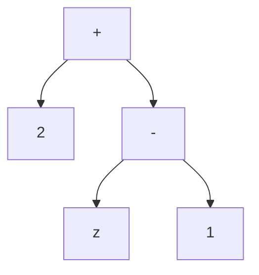
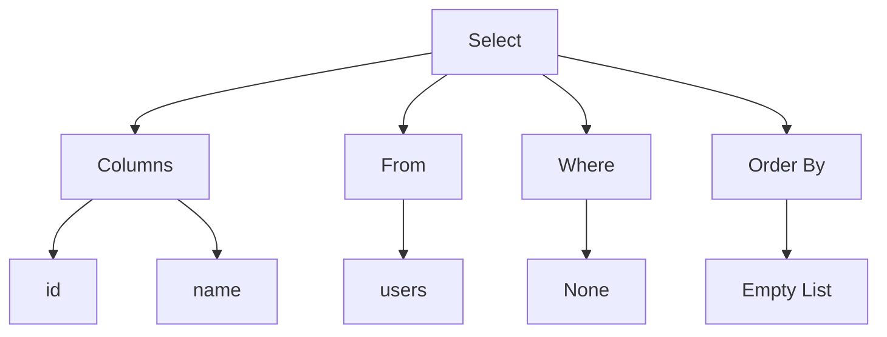

# Week 2 + 3
This week and next, our focus will be on understanding how a **SQL parser** works and how it generates an **Abstract Syntax Tree (AST)**.

## SQL Parser
In the previous Lexer phase, we transformed the raw query string into a sequence of tokens. However, having recognized tokens doesn't necessarily ensure that the sequence is a valid and meaningful query. For example: `data.csv SELECT VALUES *` is not a valid query.

The Parser phase ensures that the sequence of tokens adheres to the grammar rules of our CSV Query Language, constructing a syntactic representation of the query's structure, known as the **Abstract Syntax Tree (AST)**.

## Abstract Syntax Tree(AST)
In general, the AST models the relationships between tokens in the source code as a tree structure, where each node represents a specific component of the code. Each node contains information about the type of token and any associated data.

Let's draw the AST corresponding to the following equation:
```cpp
2 + (z - 1)
```


In the above AST representation, the nodes `+` and `-` are operators, `z` is a variable, and `1` and `2` are just literals. Notice how the parentheses are discarded in the AST; they're subsumed in the representation of `(z - 1)`: `z` and `1` are both children of the `-` operator node.

## Goal
Example SQL query:
```sql
SELECT id, name FROM users;
```
- **Parser input**: Stream of tokens
  ```cpp
  {
    Token::Keyword(Keyword::Select),
    Token::Identifier("id"),
    Token::Comma,
    Token::Identifier("name"),
    Token::Keyword(Keyword::From),
    Token::Identifier("users"),
    Token::SemiColon,
    Token::Eof
  }
  ```
- **Parser output**: AST

## Implementation
