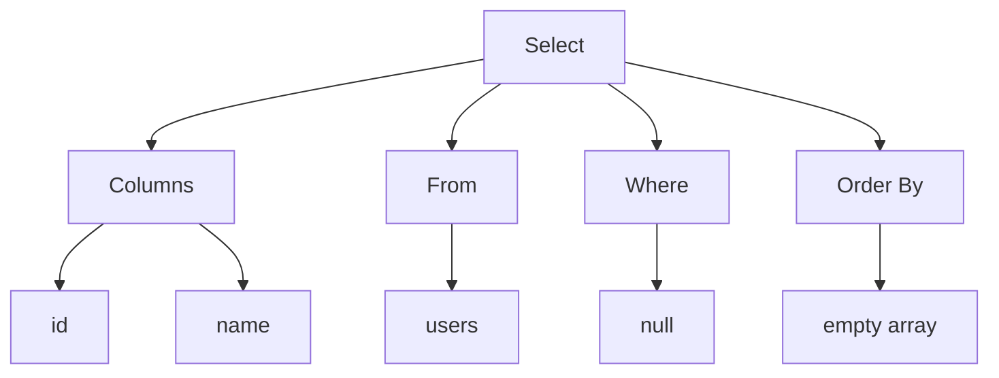
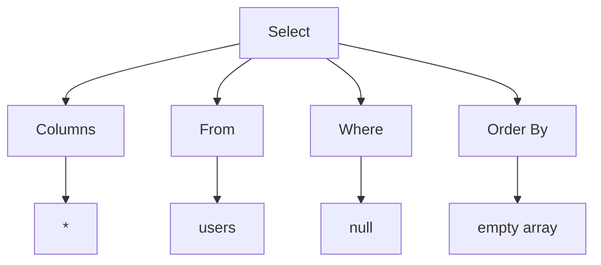

# Parser testcases

### 1. Parse Simple SELECT Statement

```sql
SELECT id, name FROM users;
```

```cpp
Statement::Select {
    columns: [
        Expression::Identifier("id"),
        Expression::Identifier("name")
    ],
    from: "users",
    where: nullptr,
    order_by: []
}
```



### 2. Parse SELECT Statement with Wildcard

```sql
SELECT * FROM users;
```

```cpp
Statement::Select {
    columns: [
        Expression::Wildcard
    ],
    from: "users",
    where: nullptr,
    order_by: []
}
```


