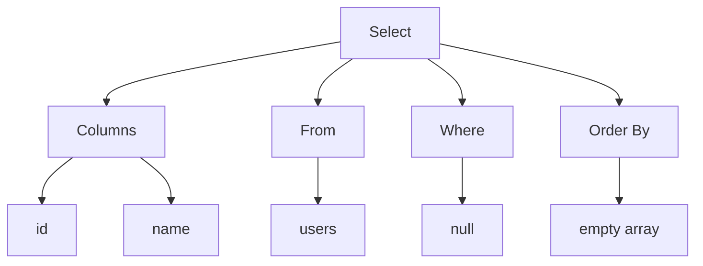
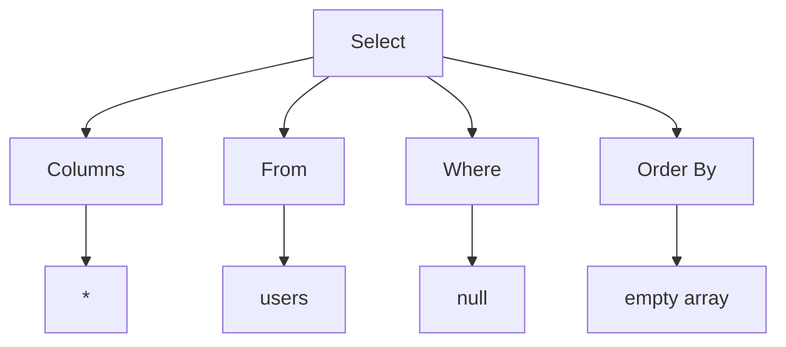
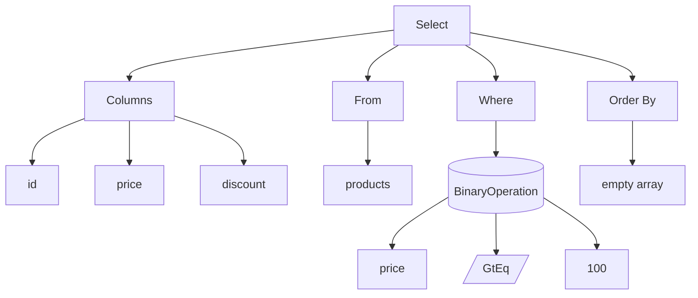
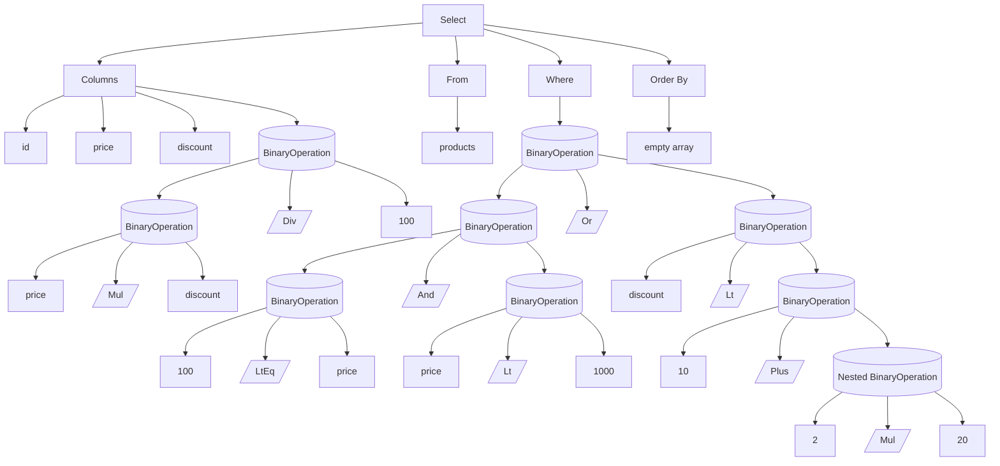

# Parser testcases

### 1. Parse Simple SELECT Statement

```sql
SELECT id, name FROM users;
```

```cpp
Statement::Select {
    columns: [
        Expression::Identifier("id"),
        Expression::Identifier("name")
    ],
    from: "users",
    where: nullptr,
    orderBy: []
}
```



### 2. Parse SELECT Statement with Wildcard

```sql
SELECT * FROM users;
```

```cpp
Statement::Select {
    columns: [
        Expression::Wildcard
    ],
    from: "users",
    where: nullptr,
    orderBy: []
}
```



### 3. Parse SELECT Statement with WHERE Clause

```sql
SELECT id, price, discount FROM products WHERE price >= 100;
```

```cpp
Statement::Select {
    columns: [
        Expression::Identifier("id"),
        Expression::Identifier("price"),
        Expression::Identifier("discount")
    ],
    from: "products",
    where: Expression::BinaryOperation {
        left: Expression::Identifier("price"),
        op: BinaryOperator::GtEq,
        right: Expression::Value(Value::Number(100))
    },
    orderBy: []
}
```



### 4. Parse SELECT Statement with Expressions

```sql
SELECT id, price, discount, price * discount / 100
FROM products
WHERE 100 <= price AND price < 1000 OR discount < 10 + (2 * 20);
```

```cpp
Statement::Select {
    columns: [
        Expression::Identifier("id"),
        Expression::Identifier("price"),
        Expression::Identifier("discount"),
        Expression::BinaryOperation {
            left: Expression::BinaryOperation {
                left: Expression::Identifier("price"),
                op: BinaryOperator::Mul,
                right: Expression::Identifier("discount")
            },
            op: BinaryOperator::Div,
            right: Expression::Value(Value::Number(100))
        }
    ],
    from: "products",
    where: Expression::BinaryOperation {
        left: Expression::BinaryOperation {
            left: Expression::BinaryOperation {
                left: Expression::Value(Value::Number(100)),
                op: BinaryOperator::LtEq,
                right: Expression::Identifier("price")
            },
            op: BinaryOperator::And,
            right: Expression::BinaryOperation {
                left: Expression::Identifier("price"),
                op: BinaryOperator::Lt,
                right: Expression::Value(Value::Number(1000))
            }
        },
        op: BinaryOperator::Or,
        right: Expression::BinaryOperation {
            left: Expression::Identifier("discount"),
            op: BinaryOperator::Lt,
            right: Expression::BinaryOperation {
                left: Expression::Value(Value::Number(10)),
                op: BinaryOperator::Plus,
                right: Expression::Nested(
                    Expression::BinaryOperation {
                        left: Expression::Value(Value::Number(2)),
                        op: BinaryOperator::Mul,
                        right: Expression::Value(Value::Number(20))
                    }
                )
            }
        }
    },
    orderBy: []
}
```


