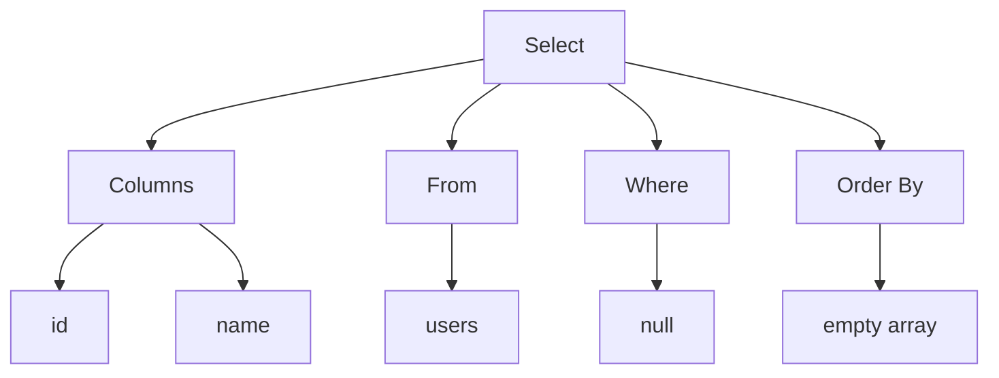
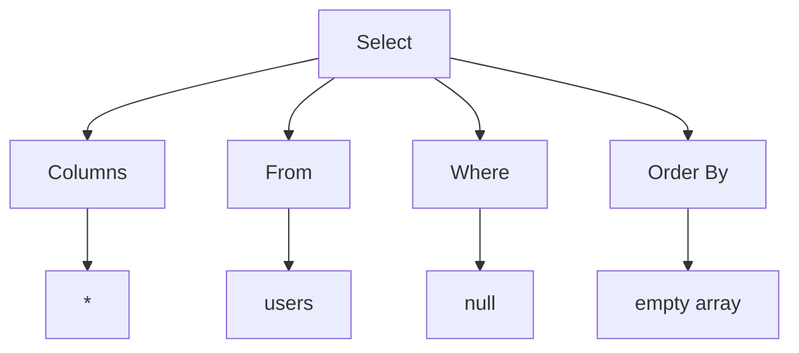
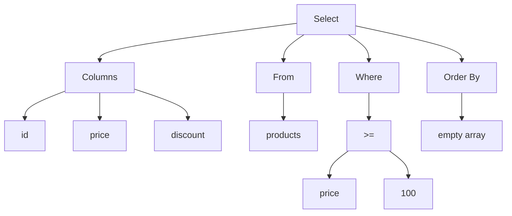

# Parser testcases

### 1. Parse Simple SELECT Statement

```sql
SELECT id, name FROM users;
```

```cpp
Statement::Select {
    columns: [
        Expression::Identifier("id"),
        Expression::Identifier("name")
    ],
    from: "users",
    where: nullptr,
    orderBy: []
}
```



### 2. Parse SELECT Statement with Wildcard

```sql
SELECT * FROM users;
```

```cpp
Statement::Select {
    columns: [
        Expression::Wildcard
    ],
    from: "users",
    where: nullptr,
    orderBy: []
}
```



### 3. Parse SELECT Statement with WHERE Clause

```sql
SELECT id, price, discount FROM products WHERE price >= 100;
```

```cpp
Statement::Select {
    columns: [
        Expression::Identifier("id"),
        Expression::Identifier("price"),
        Expression::Identifier("discount")
    ],
    from: "products",
    where: Expression::BinaryOperation {
        left: Expression::Identifier("price"),
        op: BinaryOperator::GtEq,
        right: Expression::Value(Value::Number(100))
    },
    orderBy: []
}
```


