# Parser testcases

### 1. Parse Simple SELECT Statement

```sql
SELECT id, name FROM users;
```

```cpp
Statement::Select {
    columns: [
        Expression::Identifier("id"),
        Expression::Identifier("name")
    ],
    from: "users",
    where: nullptr,
    orderBy: []
}
```

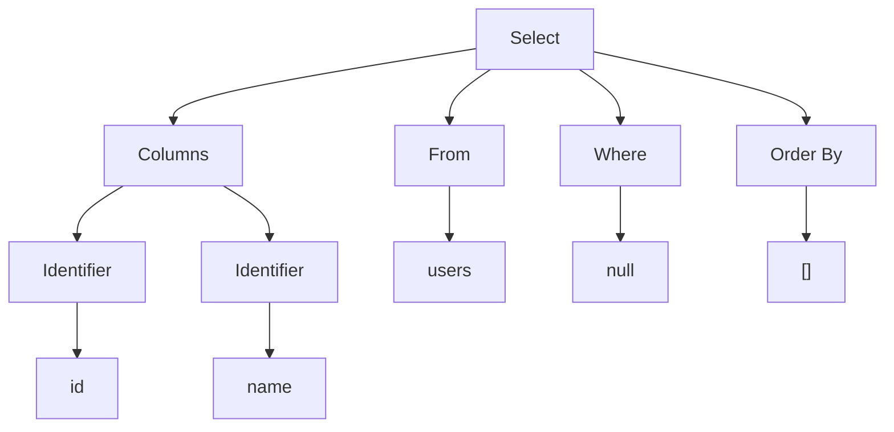

### 2. Parse SELECT Statement with Wildcard

```sql
SELECT * FROM users;
```

```cpp
Statement::Select {
    columns: [
        Expression::Wildcard
    ],
    from: "users",
    where: nullptr,
    orderBy: []
}
```

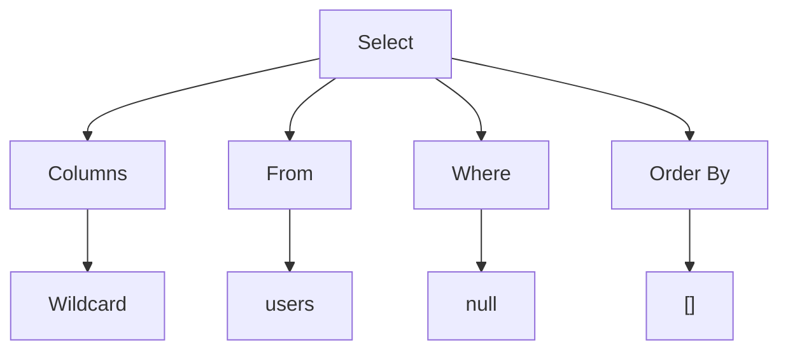

### 3. Parse SELECT Statement with WHERE Clause

```sql
SELECT id, price, discount FROM products WHERE price >= 100;
```

```cpp
Statement::Select {
    columns: [
        Expression::Identifier("id"),
        Expression::Identifier("price"),
        Expression::Identifier("discount")
    ],
    from: "products",
    where: Expression::BinaryOperation {
        left: Expression::Identifier("price"),
        op: BinaryOperator::GtEq,
        right: Expression::Value(Value::Number(100))
    },
    orderBy: []
}
```

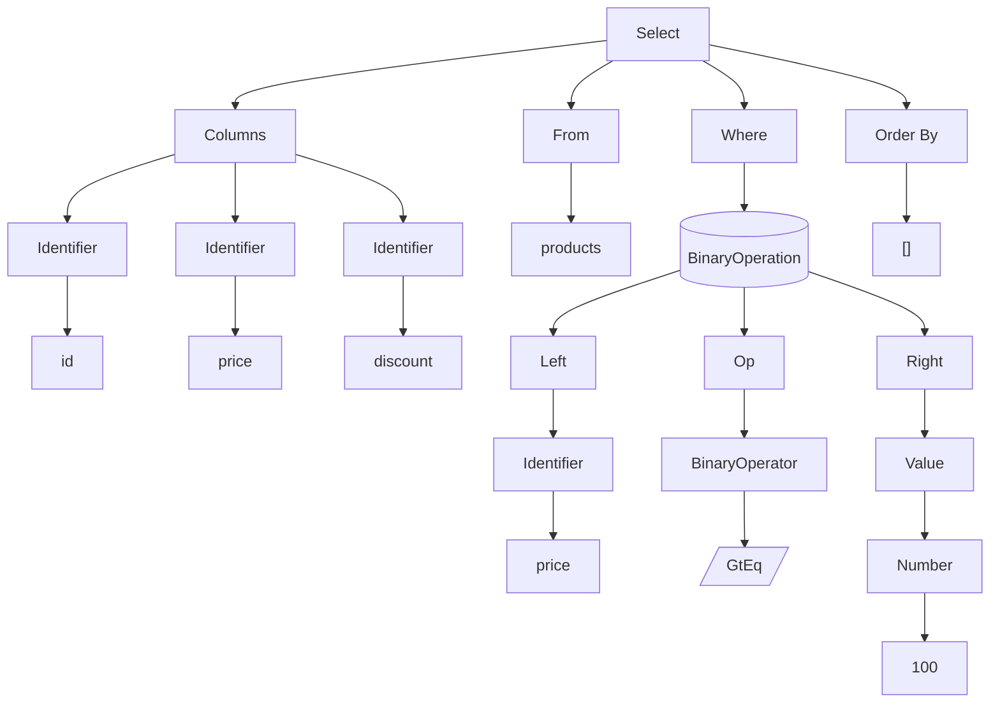

### 4. Parse SELECT Statement with Expressions

```sql
SELECT id, price, discount, price * discount / 100
FROM products
WHERE 100 <= price AND price < 1000 OR discount < 10 + (2 * 20);
```

```cpp
Statement::Select {
    columns: [
        Expression::Identifier("id"),
        Expression::Identifier("price"),
        Expression::Identifier("discount"),
        Expression::BinaryOperation {
            left: Expression::BinaryOperation {
                left: Expression::Identifier("price"),
                op: BinaryOperator::Mul,
                right: Expression::Identifier("discount")
            },
            op: BinaryOperator::Div,
            right: Expression::Value(Value::Number(100))
        }
    ],
    from: "products",
    where: Expression::BinaryOperation {
        left: Expression::BinaryOperation {
            left: Expression::BinaryOperation {
                left: Expression::Value(Value::Number(100)),
                op: BinaryOperator::LtEq,
                right: Expression::Identifier("price")
            },
            op: BinaryOperator::And,
            right: Expression::BinaryOperation {
                left: Expression::Identifier("price"),
                op: BinaryOperator::Lt,
                right: Expression::Value(Value::Number(1000))
            }
        },
        op: BinaryOperator::Or,
        right: Expression::BinaryOperation {
            left: Expression::Identifier("discount"),
            op: BinaryOperator::Lt,
            right: Expression::BinaryOperation {
                left: Expression::Value(Value::Number(10)),
                op: BinaryOperator::Plus,
                right: Expression::Nested(
                    Expression::BinaryOperation {
                        left: Expression::Value(Value::Number(2)),
                        op: BinaryOperator::Mul,
                        right: Expression::Value(Value::Number(20))
                    }
                )
            }
        }
    },
    orderBy: []
}
```

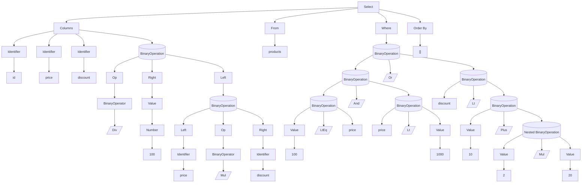

### 5. Parse Select Statement with Order By

```sql
SELECT name, email FROM users ORDER BY email;
```

```cpp
Statement::Select {
    columns: [
        Expression::Identifier("name"),
        Expression::Identifier("email")
    ],
    from: "users",
    where: nullptr,
    order_by: [
        Expression::Identifier("email")
    ]
}
```

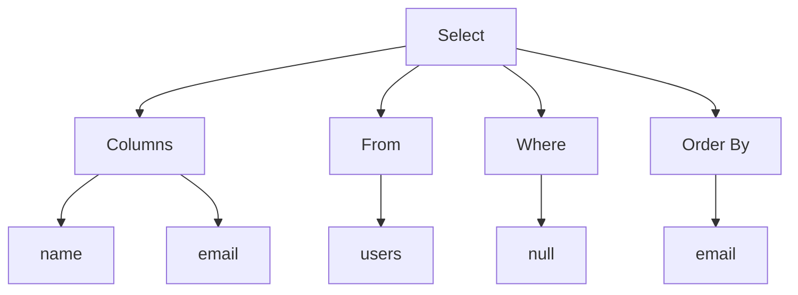

### 6. Parse CREATE TABLE Statement

```sql
CREATE TABLE users (
    id INT PRIMARY KEY,
    name VARCHAR(255),
    email VARCHAR(255) UNIQUE
);
```

```cpp
Statement::Create {
    name: "users",
    columns: [
        Column::primaryKey("id", DataType::Int),
        Column::newColumn("name", DataType::Varchar(255)),
        Column::unique("email", DataType::Varchar(255))
    ]
}
```

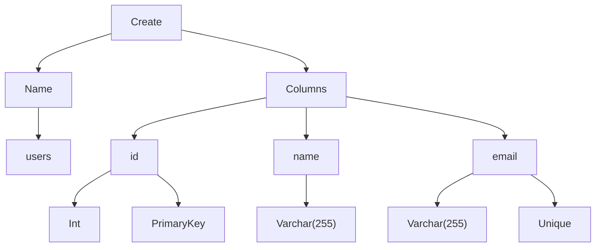

### 7. Parse Simple UPDATE Statement

```sql
UPDATE users SET is_admin = 1;
```

```cpp
Statement::Update {
    table: "users",
    columns: [
        Assignment {
            identifier: "is_admin",
            value: Expression::Value(Value::Number(1)),
        }
    ],
    where: nullptr,
}
```

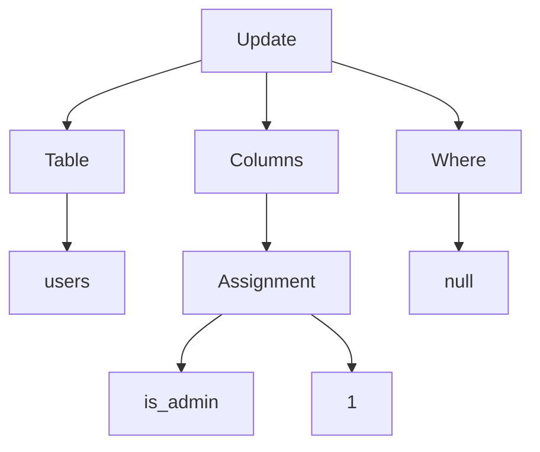

### 8. Parse UPDATE Statement with WHERE Clause

```sql
UPDATE products
SET price = price - 10, discount = 15, stock = 10
WHERE price > 100;
```

```cpp
Statement::Update {
    table: "products",
    columns: [
        Assignment {
            identifier: "price",
            value: Expression::BinaryOperation {
                left: Expression::Identifier("price"),
                op: BinaryOperator::Minus,
                right: Expression::Value(Value::Number(10)),
            }
        },
        Assignment {
            identifier: "discount",
            value: Expression::Value(Value::Number(15))
        },
        Assignment {
            identifier: "stock",
            value: Expression::Value(Value::Number(10))
        }
    ],
    where: Expression::BinaryOperation {
        left: Expression::Identifier("price"),
        op: BinaryOperator::Gt,
        right: Expression::Value(Value::Number(100)),
    }
}
```

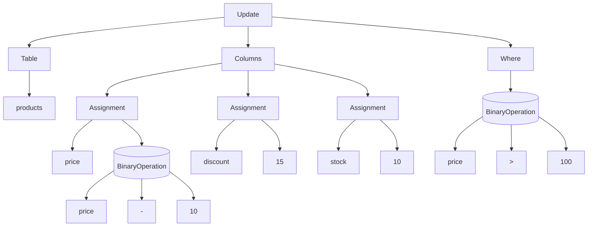

### 9. Parse DELETE Statement

```sql
DELETE FROM products;
```

```cpp
Statement::Delete {
    from: "products",
    where: nullptr
}
```

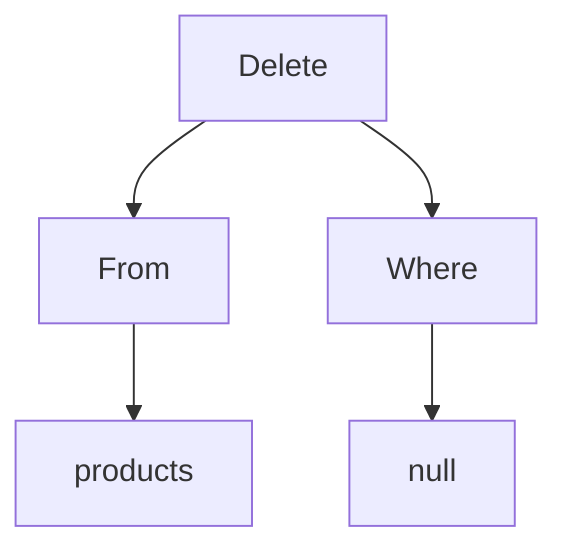

### 10. Parse DELETE Statement with WHERE Clause

```sql
DELETE FROM products WHERE price > 5000;
```

```cpp
Statement::Delete {
    from: "products",
    where: Expression::BinaryOperation {
        left: Expression::Identifier("price"),
        op: BinaryOperator::Gt,
        right: Expression::Value(Value::Number(5000)),
    }
}
```

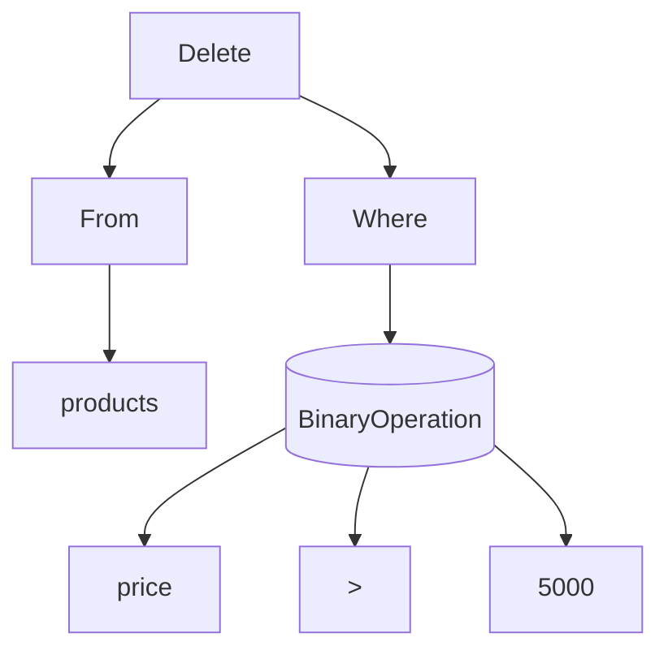

### 11. Parse INSERT Statement

```sql
INSERT INTO users (id, name, email) VALUES (1, "Test", "test@test.com");
```

```cpp
Statement::Insert {
    into: "users",
    columns: [
        "id",
        "name",
        "email"
    ],
    values: [
        Expression::Value(Value::Number(1)),
        Expression::Value(Value::String("Test")),
        Expression::Value(Value::String("test@test.com"))
    ]
}
```

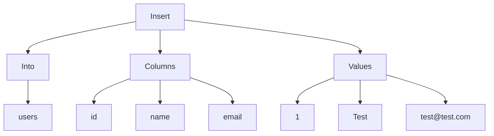

### 12. Parse INSERT Statement without Specified Columns

```sql
INSERT INTO users VALUES (1, "Test", "test@test.com");
```

```cpp
Statement::Insert {
    into: "users",
    columns: [],
    values: [
        Expression::Value(Value::Number(1)),
        Expression::Value(Value::String("Test")),
        Expression::Value(Value::String("test@test.com"))
    ]
}
```

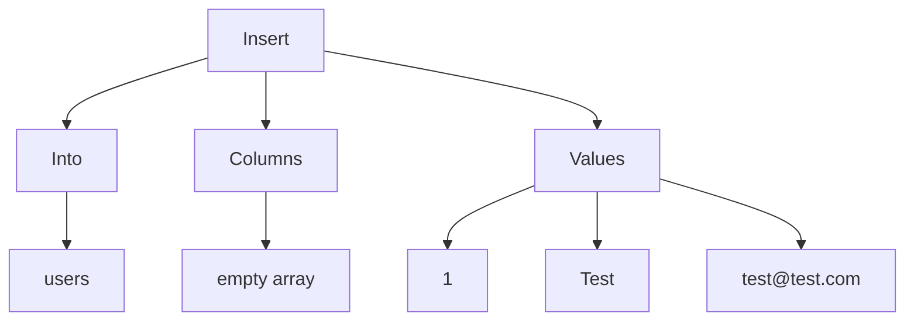

### 13. Parse DROP TABLE Statement

```sql
DROP TABLE test;
```

```cpp
Statement::Drop("test")
```

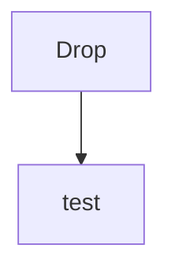

### 14. Parse Multiple Statements

```sql
DROP TABLE test;
UPDATE users SET is_admin = 1;
SELECT * FROM products;
```

```cpp
[
    Statement::Drop("test"),
    Statement::Update {
        table: "users",
        columns: [
            Assignment {
                identifier: "is_admin",
                value: Expression::Value(Value::Number(1)),
            }
        ],
        where: nullptr,
    },
    Statement::Select {
        columns: [
            Expression::Wildcard
        ],
        from: "products",
        where: nullptr,
        orderBy: [],
    }
]
```

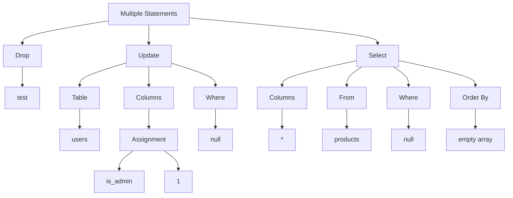

### 15. Parse Arithmetic Operator Precedence

```cpp
price * discount / 100 < 10 + 20 * 30
```

```cpp
Expression::BinaryOperation {
    left: Expression::BinaryOperation {
        left: Expression::BinaryOperation {
            left: Expression::Identifier("price"),
            op: BinaryOperator::Mul,
            right: Expression::Identifier("discount")
        },
        op: BinaryOperator::Div,
        right: Expression::Value(Value::Number(100))
    },
    op: BinaryOperator::Lt,
    right: Expression::BinaryOperation {
        left: Expression::Value(Value::Number(10)),
        op: BinaryOperator::Plus,
        right: Expression::BinaryOperation {
            left: Expression::Value(Value::Number(20)),
            op: BinaryOperator::Mul,
            right: Expression::Value(Value::Number(30))
        }
    }
}
```

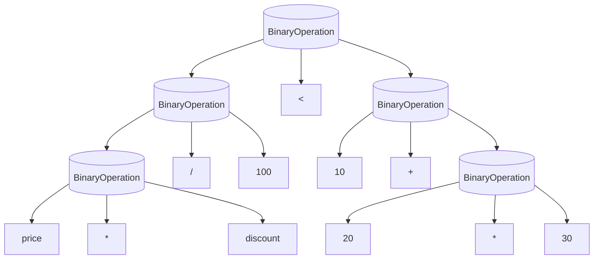

### 16. Parse Nested Arithmetic Precedence

```sql
price * discount >= 10 - (20 + 50) / (2 * (4 + (1 - 1)))
```

```cpp
Expression::BinaryOperation {
    left: Expression::BinaryOperation {
        left: Expression::BinaryOperation {
            left: Expression::Identifier("price"),
            op: BinaryOperator::Mul,
            right: Expression::Identifier("discount")
        },
        op: BinaryOperator::GtEq,
        right: Expression::BinaryOperation {
            left: Expression::Value(Value::Number(10)),
            op: BinaryOperator::Minus,
            right: Expression::BinaryOperation {
                left: Expression::Nested(
                    Expression::BinaryOperation {
                        left: Expression::Value(Value::Number(20)),
                        op: BinaryOperator::Plus,
                        right: Expression::Value(Value::Number(50)),
                    }
                ),
                op: BinaryOperator::Div,
                right: Expression::Nested(
                    Expression::BinaryOperation {
                        left: Expression::Value(Value::Number(2)),
                        op: BinaryOperator::Mul,
                        right: Expression::Nested(
                            Expression::BinaryOperation {
                                left: Expression::Value(Value::Number(4)),
                                op: BinaryOperator::Plus,
                                right: Expression::Nested(
                                    Expression::BinaryOperation {
                                        left: Expression::Value(Value::Number(1)),
                                        op: BinaryOperator::Minus,
                                        right: Expression::Value(Value::Number(1)),
                                    }
                                )
                            }
                        )
                    }
                )
            }
        }
    },
    op: BinaryOperator::GtEq,
    right: Expression::BinaryOperation {
        left: Expression::Value(Value::Number(10)),
        op: BinaryOperator::Minus,
        right: Expression::BinaryOperation {
            left: Expression::Nested(
                Expression::BinaryOperation {
                    left: Expression::Value(Value::Number(20)),
                    op: BinaryOperator::Plus,
                    right: Expression::Value(Value::Number(50)),
                }
            ),
            op: BinaryOperator::Div,
            right: Expression::Nested(
                Expression::BinaryOperation {
                    left: Expression::Value(Value::Number(2)),
                    op: BinaryOperator::Mul,
                    right: Expression::Nested(
                        Expression::BinaryOperation {
                            left: Expression::Value(Value::Number(4)),
                            op: BinaryOperator::Plus,
                            right: Expression::Nested(
                                Expression::BinaryOperation {
                                    left: Expression::Value(Value::Number(1)),
                                    op: BinaryOperator::Minus,
                                    right: Expression::Value(Value::Number(1)),
                                }
                            )
                        }
                    )
                }
            )
        }
    }
}
```

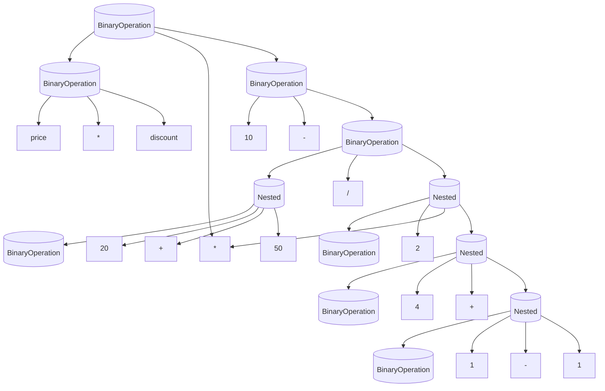
